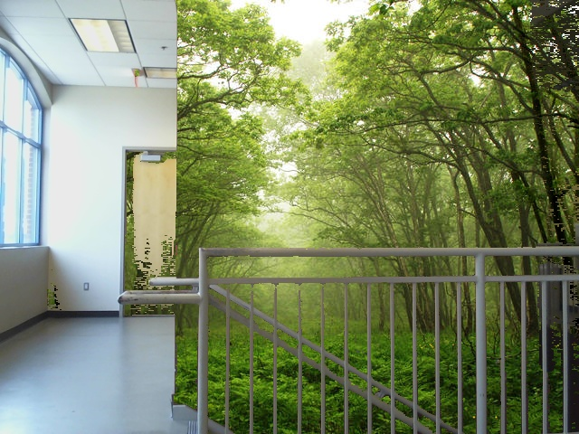
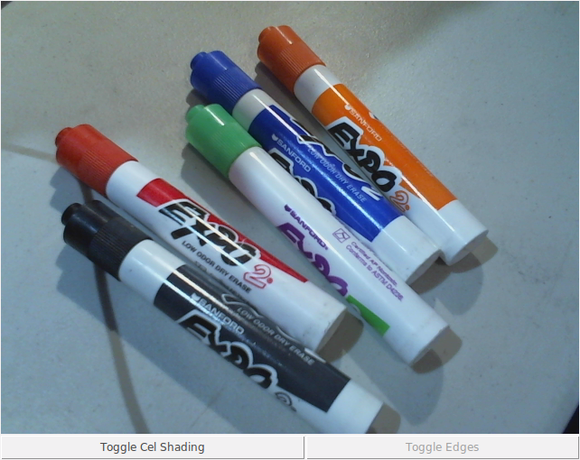
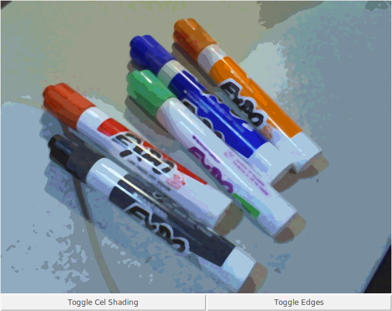
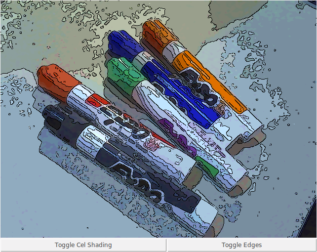
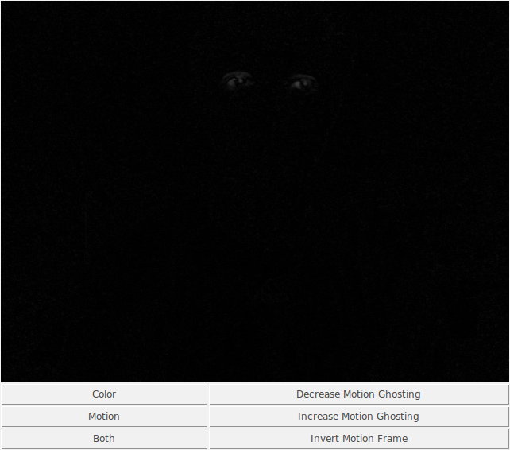

# Python Webcam

### What's this?

This is a small set of webcam stream processing programs I've written for fun and because they're cool. They primarily do motion and color processing effects. 

When you run a program, it will do a check for necessary libraries, and notify you if it needs any. Install those, and you should be good to go.

### greenscreen.py

This program filters out a chosen color from the webcam stream, filling all regions of that color with a background image (provided as `forest.jpg`, which I shamelessly stole from the internet). 

To select a color for filtering, click on it from the stream. If you click on a region that has been greenscreened out, it will choose the color behind the screen, on the actual stream. You can choose as many colors as you want.

To remove filters (in most recent order), click "Remove last mask". To remove all filters, click "No mask".

This is a frame I took from the program. On the left, you see the inside of a building. On the right, the wall of a stairwell was masked out. The door was masked a little bit because the color was too close to that of the wall.

##### TODO:

-   Allow a user to choose their own background image, and provide a warning if the dimensions are incorrect.

### cel_webcam.py

In short, this is a program that does Cel shading on the webcam. It can also do Canny edge detection on the stream, to provide outlines on everything. 

Cel shading is a graphics technique that makes everything look cartoony. Instead of having realistic lighting, shadows, textures, and so on, it uses a very limited set of colors. These colors come in pairs - a light "normal" version and a dark "shadowed" version. 

This shows a few markers as a reference.

This shows the effects of cel shading.

This adds line borders to the regions of color.

##### TODO:

-   Fix the grainy output. 
-   Add ability to read from a config file. This will be useful for setting how much blur to put on the stream, among other things. 

### webcam.py

This provides multiple motion detection features on a webcam. 

There are three modes:

-   Color. This is a standard webcam stream. Nothing notable.
-   Motion. This is a motion detection mode for the stream.
-   Both. This can do one of two things. If the motion capture is not inverted (see below), then it will provide a motion capture overlay on the normal color stream. If the motion capture is inverted, it will show only the parts of the color stream that are moving.

Additionally, there are two settings:

-   Ghosting. This is how much of a border to put on motion. Less ghosting means a sharper, but harder to see, outline on anything moving. More ghosting is the opposite.

-   Invert the motion frame. This changes if the motion display has black on white (default) or white on black. Additionally, this will affect the _both_ mode, as outlined above.

    ​

The reason motion capture gives outlines instead of the entire moving object is because it's looking at pixels that change. If you're wearing a blue shirt and move around, all pixels that represent that shirt will remain blue. Thus, those pixels didn't "move". 

A screenshot of the program has been provided below of the motion capture mode. Those two dots are my eyes. Other than blinking, I'm sitting very still.

### color_tracker.py

This program tracks the motion of items of a certain color. To use this program, click on an object to choose that color for tracking. Anything of that color will be considered for which has the most motion, or if there's a significant amount of motion at all. 

Screenshots to be added soon.